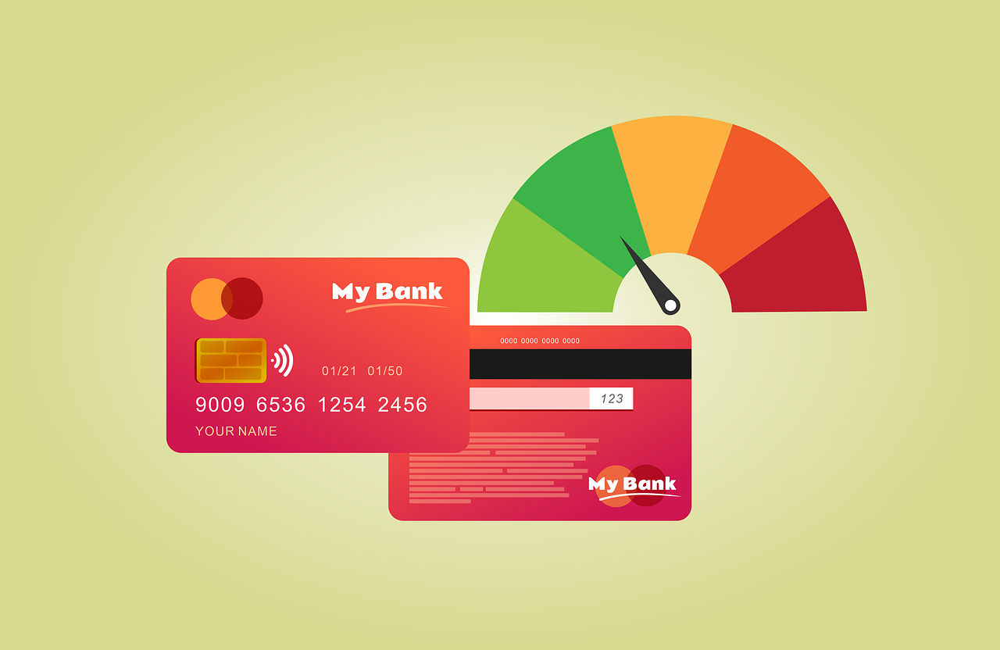

# Credit Score Classification

Image by <a href="https://pixabay.com/users/pabitrakaity-7844390/?utm_source=link-attribution&utm_medium=referral&utm_campaign=image&utm_content=6401275">Pabitra Kaity</a> from <a href="https://pixabay.com//?utm_source=link-attribution&utm_medium=referral&utm_campaign=image&utm_content=6401275">Pixabay</a>

## Introduction

To determine customers creditworthiness, banks and credit card companies calculate credit score. It helps banks and credit card companies to issue loans immediately to customers with good creditworthiness. Today banks and credit card companies use Machine Learning algorithms to classify all the customers in their database based on their credit history. In this project, a machine model is built using Rain Forest Classifier to predict credit score of customers.

## About the Datasets

The data used can be found [here](https://www.kaggle.com/datasets/parisrohan/credit-score-classification)

## Dependences

The libraries used in this project are as follows:
* Pandas
* Numpy
* Plotly express
* Sklearn

## Data Cleaning

The dataset is clean with no missing values.

## Exploratory Data Analysis

In exploration of the data, credit score was explored across variables like occupation, age, annual income, monthly salary, and number of credit cards. See notebook for visualization of this explorations.

## Model Building and Prediction

An important feature the "Credit Mix" in the dataset is valuable for determining credit scores. The "Credit Mix" feature tells the us the types of credits and loans a customer have taken. As the Credit_Mix column is categorical, it is transformed into a numerical feature so that it can use to train a Machine Learning model for the task of credit score classification. The data is split with credit score as the target vector and other features as the target matrix. Note however that features like "Name of customer" that have no impact on credit score were dropped. A rain forest classifier is then built and fitted with the data.

## Model Evaluation

The accuracy score of the model was found to be 0.82095. This shows that the model is fairly good in predicting the credit score of customers.

## Conclussion

Customers needs to be classified based on their credit scores to helps banks and credit card companies issue loans to customers with good creditworthiness effortlessly. A person with a good credit score will get loans from any bank or any financial institution.